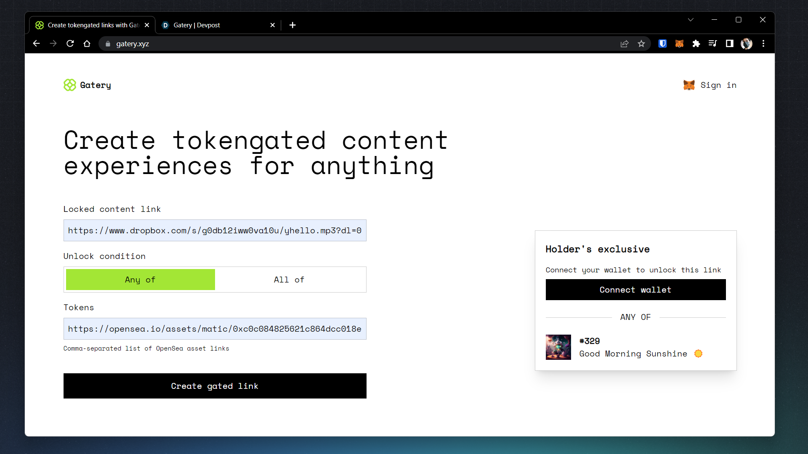
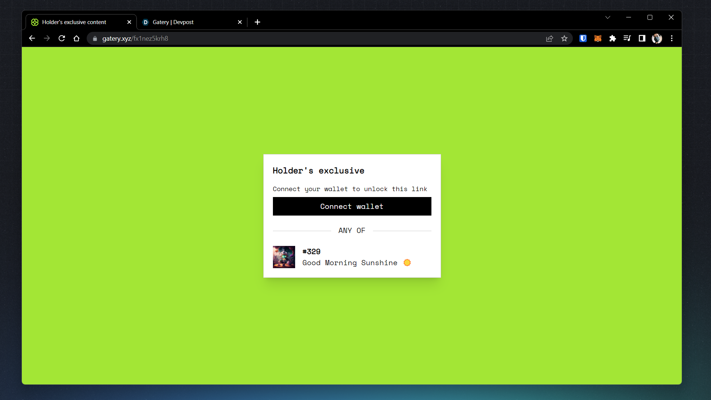

  
  <h3 align="center">Gatery</h3>
  

    
    
    
  

---

## Screenshots

## Inspiration
NFTs unlock a huge potential for community ownership, brand-collaboration, and loyalty members.
So, the inspiration for this project came for a solution that does not require any technical knowledge to implement those community power-ups. Gatery aims to allow anyone to offer exclusive content unlocked through a link, think of bitly but with the web3 power-ups.

Through links anybody can offer discounts, exclusive content, and anything else they want to make available only for holders of specific collections, as it is not attached to a single NFT, creators can collaborate and offer deals for NFT holders of communities.

## What it does
It allows any person to create tokengated links that they can determine which NFTs holders must have to get access to the contents of the link, users must connect their MetaMask wallet and it will verify if the wallet holds any of the required NFTs, it it's valid, they'll then be redirected to the link.

## How we built it
It was build using Next.js and the Firestore DB from Google Cloud to store gates details, it also uses Verbwire API to fetch and validate NFT details and owners. For styling I used Tailwind CSS. Deploy's on Vercel.

## Challenges we ran into
It was complicated to fetch NFT data because the API only retrieves the IPFS URL to fetch all details, so I had to make a fetch for every NFT so I can retrieve details.

## Accomplishments that we're proud of
The UI looks very good, and everything seems to work as expected, I also accomplished most of the work in the last hours.

## What's next for Gatery
Enable more tokengating plugins, so it can be used on websites, and integrated with others services such as ecommerce.
